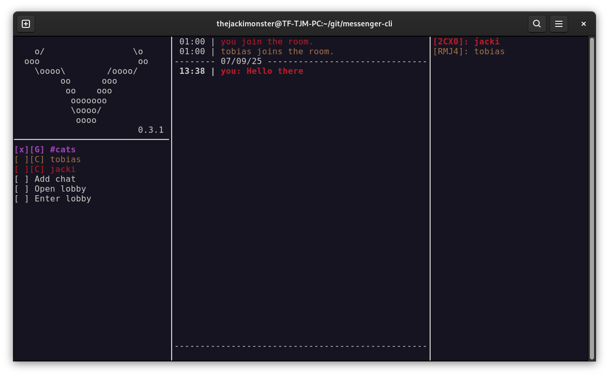

# messenger-cli

A CLI for the Messenger service of GNUnet.

[](https://snapcraft.io/messenger-cli)

```
                            
    o                   o   
  ooo                   oo  
     ooooo        ooooo     
         oo      ooo        
          oo    ooo         
           ooooooo          
           oooooo           
            oooo            
                            

```



## Details

The tool messenger-cli is an terminal interface for the GNUnet Messenger service. The goal is to provide private and secure communication between any group of devices.

Chats will generally created as opt-in. So you can decide who may contact you directly and who does not, accepting to a direct chat. Leaving a chat is also always possible.

## Build & Installation

The following dependencies are required and need to be installed to build the application:

 - [gnunet](https://git.gnunet.org/gnunet.git/): For using general GNUnet datatypes
 - [libgnunetchat](https://git.gnunet.org/libgnunetchat.git/): For chatting via GNUnet messenger
 - [ncurses](https://www.gnu.org/software/ncurses/): For the general UI visualization
 - [libsecret](https://gitlab.gnome.org/GNOME/libsecret): For storing and receiving secrets to encrypt/decrypt local keys

Then you can simply use [Meson](https://mesonbuild.com/) as follows:
```
meson setup build      # Configure the build files for your system
ninja -C build         # Build the application using those build files
ninja -C build install # Install the application
```

Here is a list of some useful build commands using Meson and [Ninja](https://ninja-build.org/):

 - `meson compile -C build` to just compile everything with configured parameters
 - `rm -r build` to cleanup build files in case you want to recompile
 - `meson install -C build` to install the compiled files (you might need sudo privileges)
 - `meson dist -C build` to create a tar file for distribution
 - `ninja -C build uninstall` to uninstall a previous installation (you might need sudo privileges)

If you want to change the installation location, use the `--prefix=` parameter in the initial meson command. Also you can enable optimized release builds by adding `--buildtype=release` as parameter.

## Contribution

If you want to contribute to this project as well, the following options are available:

 - Contribute directly to the [source code](https://git.gnunet.org/messenger-cli.git/) with patches to fix issues, implement new features or improve the usability.
 - Open issues in the [bug tracker](https://bugs.gnunet.org/bug_report_page.php) to report bugs, issues or missing features.
 - Contact the authors of the software if you need any help to contribute (testing is always an option).

The list of all previous authors can be viewed in the provided [file](AUTHORS).

